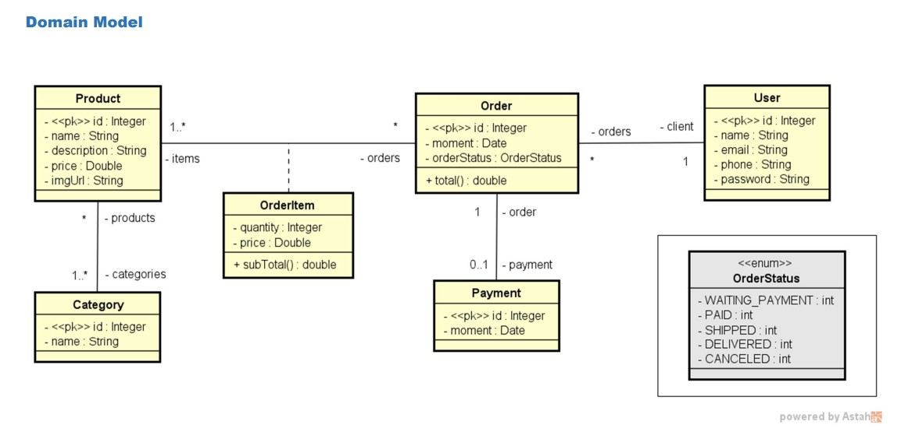
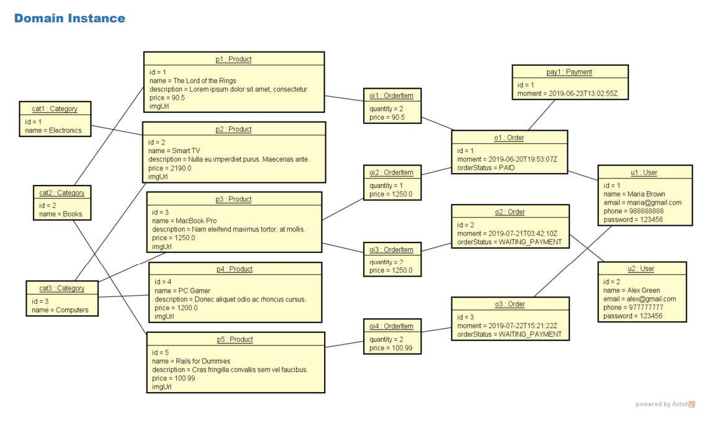

# Projeto web services com Spring Boot e JPA / Hibernate
## Descrição
Projeto simulando uma loja, onde os usuários fazem pedidos de produtos, e nele há todo um controle de pagamento, pedido, produto, categoria do produto e usuário.
## Modelo de domínio

## Instância de domínio

## Ferramentas utilizadas
* Java
* Spring Boot
* JPA
* Hibernate
* H2 Console
* Maven
* Postman
